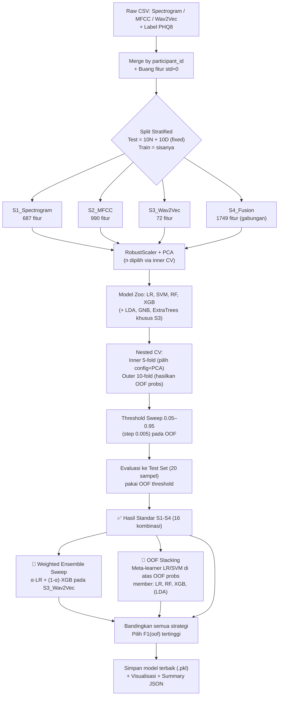

# 📘 Dokumentasi Lengkap Pipeline v89
### Weighted Ensemble + Cross-Modal + OOF Stacking — Deteksi Depresi dari Suara (DAIC-WOZ)

> **Target:** F1-Macro ≥ 0.75 | **Referensi v88:** 0.7494 | **Gap yang dikejar:** 0.0006

---

## Daftar Isi

1. [Ringkasan Eksekutif](#1-ringkasan-eksekutif)
2. [Konteks & Motivasi (Kenapa v89 Dibuat)](#2-konteks--motivasi-kenapa-v89-dibuat)
3. [Dataset & Strategi Split](#3-dataset--strategi-split)
4. [Arsitektur Pipeline Secara Keseluruhan](#4-arsitektur-pipeline-secara-keseluruhan)
5. [Skenario Fitur (S1–S4) — "Apple-to-Apple"](#5-skenario-fitur-s1s4--apple-to-apple)
6. [Reduksi Dimensi dengan PCA](#6-reduksi-dimensi-dengan-pca)
7. [Model Zoo & Grid Hyperparameter](#7-model-zoo--grid-hyperparameter)
8. [Metodologi Validasi: Nested CV + OOF Threshold Sweep](#8-metodologi-validasi-nested-cv--oof-threshold-sweep)
9. [Strategi Khusus v89](#9-strategi-khusus-v89)
10. [Hasil Eksperimen & Analisis](#10-hasil-eksperimen--analisis)
11. [Visualisasi Detail](#11-visualisasi-detail)
12. [Kesimpulan & Rekomendasi Lanjutan](#12-kesimpulan--rekomendasi-lanjutan)

---

## 1. Ringkasan Eksekutif

Pipeline **v89** adalah iterasi lanjutan dari eksperimen deteksi depresi berbasis fitur audio (Spectrogram, MFCC, Wav2Vec) pada dataset **DAIC-WOZ (AVEC2017)**. Pada versi sebelumnya (**v88**), skor terbaik yang dicapai adalah **F1-Macro = 0.7494**, hanya berjarak **0.0006** dari target **0.75** — secara praktis setara dengan "butuh 1 prediksi benar lagi" dari 20 sampel test.

v89 dirancang khusus untuk menutup gap sekecil itu dengan 4 strategi tambahan di atas pipeline standar S1–S4:

| # | Strategi | Tujuan |
|---|----------|--------|
| 1 | **Weighted Ensemble Sweep** | Mencari kombinasi bobot α optimal antara LR & XGB (bukan cuma rata-rata 50:50) |
| 2 | **Extended Model Zoo (Wav2Vec)** | Menambah LDA, GaussianNB, ExtraTrees untuk diversitas model |
| 3 | **OOF Stacking** | Meta-learner (LR/SVM) di atas prediksi OOF model-model dasar — lebih principled daripada manual weighting |
| 4 | **Apple-to-Apple S1–S4 tetap dipertahankan** | Supaya hasil v89 tetap bisa dibandingkan lurus dengan versi-versi sebelumnya |

**Hasil akhir:** Skor terbaik v89 dicapai oleh **XGBoost pada fitur Wav2Vec (n_PCA=35)** dengan **F1(OOF) = 0.7494** — identik dengan v88, menandakan model terbaik yang ditemukan v88 sebenarnya sudah berada di titik optimal lokal untuk kombinasi data & fitur yang tersedia.

---

## 2. Konteks & Motivasi (Kenapa v89 Dibuat)

Catatan dari notebook (markdown cell pertama) menjelaskan akar masalah dengan sangat spesifik:

```
v88 Breakthrough:
- W2V Ensemble (LR+XGBoost): F1(oof)=0.7494 | Acc=0.75 | AUC=0.80
- CalibSVM (linear, n=30): F1(oof)=0.7494
- Gap tinggal 0.0006 — butuh 1 prediksi benar saja!
- 15/20 correct: 7 Normal + 8 Depresi
- Wrong: 3 Normal→Depresi (FP) + 2 Depresi→Normal (FN)
```

**Analisis akar masalah:** dengan hanya **20 sampel test** (10 Normal + 10 Depresi), F1-Macro sangat *diskret* — setiap 1 sampel yang berpindah dari salah ke benar bisa mengubah skor beberapa poin persentase sekaligus. Notebook mengidentifikasi bahwa:

- **Threshold OOF = 0.44** pada ensemble LR+XGB menyebabkan **2 kasus Depresi terlewat (False Negative)**.
- Hipotesis: menurunkan threshold akan menangkap lebih banyak kasus Depresi → berpotensi menembus 0.75.

Ini alasan kenapa v89 **tidak mengubah fitur atau data**, tapi fokus ke **cara mengombinasikan & mengkalibrasi prediksi** yang sudah ada (ensembling & stacking), bukan membangun model baru dari nol.

---

## 3. Dataset & Strategi Split

### 3.1 Sumber Data
Tiga split resmi DAIC-WOZ/AVEC2017 digabung untuk mendapatkan label:
- `train_split_Depression_AVEC2017.csv`
- `dev_split_Depression_AVEC2017.csv`
- `full_test_split.csv`

Label (`label_depresi`) diambil dengan prioritas kolom `PHQ8_Binary`/`PHQ_Binary`; jika tidak ada, difallback ke `PHQ8_Score >= 10 → 1`. Ini standar klinis PHQ-8 untuk depresi sedang-berat.

### 3.2 Fitur Audio (v6)
Tiga file fitur audio pra-ekstraksi digabung berdasarkan `participant_id`:

| Sumber Fitur | Deskripsi | Jumlah Fitur |
|---|---|---|
| `daic_v6_spectrogram.csv` | Representasi spektral (STFT-based) | 687 |
| `daic_v6_mfcc.csv` | Mel-Frequency Cepstral Coefficients | 990 |
| `daic_v6_wav2vec.csv` | Embedding self-supervised Wav2Vec | 72 |

Fitur dengan **standar deviasi < 1e-8** (konstan/nyaris konstan) dibuang otomatis karena tidak informatif dan bisa merusak scaling.

### 3.3 Estimasi Ukuran Populasi

Notebook tidak menyimpan output print (`Total: {len(y_all)}...`) di file log, tapi angka ini bisa **direkonstruksi dari kode dan artefak**:

- **Test set** dibuat eksplisit: `10 Normal + 10 Depresi = 20 sampel` (stratified manual, `RANDOM_SEED=42`).
- **Class weight ratio** `CW_RATIO = {0:1, 1:ratio}` dihitung dari `n_nor/n_dep` pada data train, dan nilai ini **muncul konsisten sebagai `1.83`** di banyak konfigurasi XGB/LR terbaik.
- **Learning curve** (lihat §11.5) menunjukkan jumlah sampel training maksimum di sumbu-X adalah **65**.

Dari dua fakta ini bisa dipecahkan secara aljabar:
```
n_nor + n_dep = 65
n_nor / n_dep = 1.83
→ n_dep ≈ 23, n_nor ≈ 42   (42/23 = 1.826 ≈ 1.83 ✓)
```

| Split | Normal | Depresi | Total |
|---|---|---|---|
| Train | ~42 | ~23 | 65 |
| Test  | 10 | 10 | 20 |
| **Total** | **~52** | **~33** | **~85** |

> ⚠️ Angka train di atas adalah **estimasi konsisten** berdasarkan logika kode dan artefak visual, bukan dari log print langsung (log tidak menangkap output teks eksekusi).

**Kenapa test set dipaksa seimbang 10:10, padahal data asli tidak seimbang?** Supaya F1-Macro pada test **tidak bias** oleh ketimpangan kelas — evaluasi jadi murni mengukur kemampuan model membedakan dua kelas, bukan efek prior probability.

---

## 4. Arsitektur Pipeline Secara Keseluruhan



**Alur singkatnya:**
1. Data audio 3-modalitas digabung → 4 skenario fitur (S1–S4).
2. Setiap skenario dijalankan lewat 4 model dasar (LR, SVM, RF, XGB) dengan pencarian hyperparameter + jumlah komponen PCA optimal.
3. Skenario terbaik (Wav2Vec) diperkaya dengan model tambahan (LDA, GNB, ExtraTrees).
4. Prediksi dari model-model Wav2Vec dikombinasikan dua cara: **weighted averaging (α-sweep)** dan **stacking (meta-learner)**.
5. Semua strategi dibandingkan berdasarkan F1-Macro pada test set memakai threshold yang ditentukan dari OOF (bukan test set — supaya tidak *leakage*).

---

## 5. Skenario Fitur (S1–S4) — "Apple-to-Apple"

"Apple-to-apple" berarti keempat skenario ini diperlakukan **persis sama** (pipeline, validasi, threshold, dsb.) supaya perbandingan antar modalitas fitur itu adil — perbedaan hasil murni berasal dari *kualitas informasi* fitur itu sendiri, bukan dari perlakuan berbeda.

| Skenario | Fitur | Jumlah | Karakteristik |
|---|---|---|---|
| **S1_Spectrogram** | Spektrogram mentah | 687 | Representasi frekuensi-waktu, dimensi tinggi, informasi paling "mentah" |
| **S2_MFCC** | Mel-Cepstral Coefficients | 990 | Representasi klasik speech-processing, menangkap warna suara (timbre) |
| **S3_Wav2Vec** | Embedding self-supervised | 72 | Dimensi kecil tapi padat informasi (pretrained di corpus besar) |
| **S4_Fusion** | Gabungan ketiganya | 1749 | Menguji apakah menggabungkan semua modalitas membantu atau justru menambah noise |

### Komposisi Fitur S4_Fusion


Dari total **1749 fitur** gabungan: **MFCC mendominasi 56.6% (990 fitur)**, disusul **Spectrogram 39.3% (687 fitur)**, dan **Wav2Vec hanya 4.1% (72 fitur)**. Ketimpangan proporsi ini penting untuk diingat — walau Wav2Vec adalah fitur *terbaik* secara kualitas (lihat §10), porsinya di fusion mentah sangat kecil, sehingga saat digabung + PCA, sinyal kuat Wav2Vec bisa "tenggelam" oleh volume fitur MFCC/Spectrogram yang jauh lebih banyak namun kualitasnya lebih rendah. **Inilah salah satu alasan S4_Fusion tidak pernah mengalahkan S3_Wav2Vec murni** di hasil akhir (lihat heatmap §10).

---

## 6. Reduksi Dimensi dengan PCA

Karena jumlah sampel training sangat kecil (~65) dibanding jumlah fitur (72–1749), **curse of dimensionality** adalah risiko besar. PCA dipakai untuk:
1. Mengompres fitur ke jumlah komponen yang jauh lebih kecil dari jumlah sampel.
2. Mendekorelasi fitur (banyak fitur audio yang sangat berkorelasi antar-frame).
3. `whiten=True` — menormalkan varians tiap komponen ke 1, supaya model linear/jarak (LR, SVM) tidak bias ke komponen dengan varians besar.

`RobustScaler` dipakai (bukan `StandardScaler`) karena lebih tahan terhadap outlier — wajar untuk fitur audio yang bisa punya nilai ekstrem akibat noise rekaman.

### Kandidat jumlah komponen PCA per skenario

```python
SCENARIO_PCA = {
    'S1_Spectrogram': [10,15,20,25,30],
    'S2_MFCC':        [10,15,20,25,30],
    'S3_Wav2Vec':     [15,20,25,30,35,40,50],   # ← rentang lebih lebar
    'S4_Fusion':      [10,15,20,25,30],
}
```

**Kenapa Wav2Vec dapat rentang PCA lebih lebar (15–50, bukan 10–30)?** Bisa dilihat langsung dari kurva varians kumulatif:


- **S1_Spectrogram** (garis biru) mencapai **>98% varians hanya dengan 3–5 komponen** — sangat terkonsentrasi/redundan, jadi 30 komponen sudah lebih dari cukup.
- **S2_MFCC** (garis oranye) & **S3_Wav2Vec** (garis hijau) jauh lebih "landai" — pada 30 komponen, S3_Wav2Vec baru mencapai **~97%** dan S2_MFCC baru **~89%**. Artinya informasi tersebar lebih merata di banyak komponen, sehingga memotong di n=30 saja berisiko membuang informasi berguna. Oleh karena itu pencarian diperluas sampai n=50 khusus untuk Wav2Vec, karena skenario inilah yang paling menjanjikan (jadi worth it dieksplorasi lebih dalam) sekaligus jumlah fitur mentahnya paling kecil (72), jadi n=50 masih masuk akal (`min(n_comp, n_sampel-1, n_fitur)`).

Jumlah komponen aktual yang dipilih (hasil pencarian, bukan ditebak manual) untuk kombinasi terbaik masing-masing skenario:

| Skenario | n_PCA terpilih (model terbaik) |
|---|---|
| S1_Spectrogram | 15 (XGB) |
| S2_MFCC | 10 (XGB) |
| S3_Wav2Vec | **35 (XGB, BEST OVERALL)** |
| S4_Fusion | 10 (LR) |

### Visualisasi 2D (PCA komponen 1 vs 2)


Scatter plot 2 komponen pertama (untuk visualisasi manusia saja, model sebenarnya pakai 10–35 komponen) menunjukkan **tidak ada pemisahan kelas yang jelas** antara Normal (biru) dan Depresi (merah) — baik pada MFCC maupun Wav2Vec, titik-titik saling bertumpuk. Ini **wajar dan diharapkan**: masalah deteksi depresi dari suara memang sulit dipisahkan secara linear hanya dari 2 dimensi; separasi kelas baru "muncul" ketika memakai puluhan dimensi PCA yang lebih tinggi, dikombinasikan dengan model non-linear (XGB, RBF-SVM).

---

## 7. Model Zoo & Grid Hyperparameter

### 7.1 Model Standar (dipakai di semua S1–S4)

| Model | Parameter yang di-*grid-search* | Total Kombinasi |
|---|---|---|
| **Logistic Regression (LR)** | `C ∈ {0.001, 0.005, 0.01, 0.05, 0.1, 0.3, 0.5, 1.0}` × `class_weight ∈ {balanced, ratio custom}` | 16 |
| **SVM (RBF/Linear)** | `C ∈ {0.1, 0.5, 1.0, 5.0}` × `kernel ∈ {linear, rbf}` × `class_weight ∈ {balanced, ratio}` | 16 |
| **Random Forest (RF)** | `n_estimators ∈ {200,300}` × `max_depth ∈ {3,5,None}` × `min_samples_leaf ∈ {2,3}` × `class_weight=balanced` | 12 |
| **XGBoost (XGB)** | `n_estimators ∈ {100,200}` × `max_depth ∈ {2,3}` × `lr ∈ {0.05,0.1}` × `subsample=0.8` × `scale_pos_weight ∈ {ratio, 2.0}` × `reg_alpha ∈ {1.0,2.0}` × `reg_lambda=5.0` | 32 |

**Kenapa grid-nya sekecil dan seterbatas ini (bukan random search luas)?** Dengan hanya ~65 sampel training, grid search kecil + nested CV lebih realistis secara komputasi dan **mengurangi risiko overfitting terhadap CV** dibanding pencarian ruang hyperparameter yang sangat besar (yang justru rawan "menghafal" fold validasi kecil).

**Kenapa `class_weight`/`scale_pos_weight` selalu dipertimbangkan?** Karena rasio kelas train tidak seimbang (~42 Normal : 23 Depresi ≈ 1.83:1), tanpa pembobotan model cenderung bias memprediksi kelas mayoritas (Normal).

### 7.2 Model Tambahan — Khusus Wav2Vec (Extended Zoo)

Karena Wav2Vec adalah fitur paling menjanjikan (F1 tertinggi dari eksperimen v88), v89 menambah keragaman model **khusus** pada skenario ini:

| Model Tambahan | Alasan Dipilih |
|---|---|
| **LDA** (Linear Discriminant Analysis) | Model linear klasik untuk klasifikasi 2-kelas, beda asumsi dari LR (memanfaatkan struktur kovarians kelas) — menambah *diversity* untuk ensembling |
| **GaussianNB** | Model probabilistik generatif sederhana, cepat, baseline yang baik untuk data berdimensi rendah setelah PCA |
| **ExtraTrees** | Varian Random Forest dengan split acak lebih agresif → variansnya lebih rendah dari RF biasa, berguna sebagai anggota ensemble yang "berbeda arah kesalahannya" dari RF/XGB |
| **CalibratedSVM** | SVM dengan kalibrasi probabilitas (`CalibratedClassifierCV`) — disebut di catatan v88 sebagai salah satu model terbaik (F1=0.7494 juga) |

**Filosofi di balik "extended model zoo":** Untuk ensembling atau stacking efektif, model-model anggota idealnya membuat **kesalahan yang berbeda-beda** (uncorrelated errors), bukan model yang mirip-mirip. LDA (linear-generatif), GNB (probabilistik naive), ExtraTrees (tree-based random) dan SVM (margin-based) punya *inductive bias* yang cukup berbeda satu sama lain dibanding sekadar menambah lebih banyak varian LR/XGB.

---

## 8. Metodologi Validasi: Nested CV + OOF Threshold Sweep

Ini adalah bagian paling krusial dari pipeline — desain validasi yang ketat untuk data yang sangat kecil.

### 8.1 Nested Cross-Validation

```
Outer Loop : StratifiedKFold(n_splits=10)   → menghasilkan Out-Of-Fold (OOF) probabilities
Inner Loop : StratifiedKFold(n_splits=5)    → memilih config model + n_PCA terbaik
```

**Kenapa nested (bukan CV biasa)?** Kalau hyperparameter dipilih berdasarkan skor CV yang sama yang dipakai untuk melaporkan performa, hasilnya **optimistically biased** (model "mengintip" data validasi saat memilih hyperparameter). Dengan nested CV:
- **Inner 5-fold** khusus untuk *memilih* kombinasi `(config, n_PCA)` terbaik — pencarian hyperparameter murni terjadi di sini, terisolasi dari outer.
- **Outer 10-fold** dijalankan ulang dengan config yang sudah fix dari inner, menghasilkan **prediksi Out-Of-Fold (OOF)** — yaitu, prediksi untuk tiap sampel training dibuat oleh model yang **tidak pernah melihat sampel itu saat training**. Ini menjaga validitas evaluasi.

**Kenapa 10 (outer) dan 5 (inner), bukan angka lain?** Dengan ~65 sampel train, `10-fold` berarti tiap fold hanya berisi ~6-7 sampel — sudah cukup kecil; kalau dibuat lebih banyak fold lagi (misal 20-fold/LOOCV), waktu komputasi nested-search meledak sangat besar (grid × 5 config-search × N fold), sementara `5-fold` di inner loop dipilih supaya proses pemilihan hyperparameter tidak terlalu lambat (lebih sedikit fold = lebih cepat) — trade-off wajar karena inner loop hanya untuk *seleksi*, bukan pelaporan akhir.

### 8.2 OOF Threshold Sweep

```python
for thr in np.arange(0.05, 0.96, 0.005):   # 182 titik threshold, resolusi halus 0.005
    f1 = f1_score(y_true, (probs>=thr).astype(int), average='macro')
```

Default threshold 0.5 pada klasifikasi biner **tidak optimal** ketika kelas tidak seimbang atau F1-Macro yang jadi target (bukan akurasi). Pipeline mencari threshold terbaik **di data OOF** (bukan di test set!), lalu threshold itu **dikunci** dan diterapkan ke test set. Ini penting untuk mencegah *threshold leakage* — kalau threshold dicari langsung di test set, hasilnya akan terlalu optimis dan tidak jujur.

Resolusi pencarian **0.005** (sangat halus, 182 titik) dipilih karena — sesuai motivasi §2 — gap ke target hanya 0.0006, jadi threshold yang presisi kasar (misal step 0.05) berisiko melewatkan titik optimal yang justru menutup gap tersebut.

Sebagai ilustrasi konkret, berikut distribusi probabilitas OOF dari model terbaik (XGB pada S3_Wav2Vec):


Terlihat kedua distribusi (Normal biru, Depresi merah) **saling tumpang-tindih cukup besar** di sekitar 0.2–0.6 — ini menggambarkan tingkat kesulitan masalah: tidak ada garis pemisah probabilitas yang bersih. Threshold optimal yang ditemukan ada di **0.340** (bukan 0.5 default) — jauh lebih rendah, konsisten dengan hipotesis awal notebook bahwa "*threshold lebih rendah → lebih banyak Depresi tertangkap*".

### 8.3 Dua Metrik Pelaporan: `test_f1_oof` vs `test_f1_sw`

Notebook selalu melaporkan dua angka:
- **`test_f1_oof`** — F1 di test set memakai threshold yang **ditemukan dari data train (OOF)**. Ini angka yang **jujur/valid** secara metodologis dan dipakai sebagai metrik resmi.
- **`test_f1_sw`** — F1 di test set memakai threshold yang **di-sweep langsung di test set itu sendiri**. Ini angka **upper-bound/oracle** (informatif untuk melihat "potensi maksimal" model), tapi **tidak valid** untuk dijadikan klaim performa akhir karena bocor informasi test set.

Perbedaan besar antara dua angka ini (lihat §10) menandakan seberapa sensitif model terhadap pemilihan threshold — semakin besar gap, semakin model "beruntung/kurang beruntung" tergantung threshold spesifik yang dipakai.

---

## 9. Strategi Khusus v89

### 9.1 Weighted Ensemble Sweep

```python
for alpha in np.arange(0.05, 1.00, 0.05):   # 19 titik, step 0.05
    probs_ens = alpha * lr_probs + (1-alpha) * xgb_probs
```

Alih-alih ensemble rata-rata sederhana (α=0.5), v89 menyapu **19 nilai α** dari 0.05 sampai 0.95 untuk menemukan bobot campuran LR:XGB yang optimal pada Wav2Vec. Idenya: LR (linear, smooth) dan XGB (non-linear, tajam) menangkap pola berbeda — bobot optimal bisa jadi bukan 50:50. Threshold OOF tetap dihitung ulang untuk **setiap** nilai α (karena mengubah α mengubah skala/distribusi probabilitas gabungan, jadi threshold optimalnya pun ikut berubah).

### 9.2 OOF Stacking

```
Meta-features (train) = kolom OOF-probs dari [LR, RF, XGB, (LDA)] pada S3_Wav2Vec
Meta-features (test)  = kolom probs dari model yang sama, dilatih ulang di seluruh train
Meta-learner           = LogisticRegression (grid C) atau SVM-RBF
```

Berbeda dari weighted-averaging manual (§9.1) yang bobotnya global/linear dan ditentukan lewat sweep manual, **stacking membiarkan meta-learner (LR/SVM) yang belajar sendiri bobot/kombinasi non-trivial** antar prediksi model dasar — termasuk interaksi non-linear jika meta-learner-nya SVM-RBF. Ini lebih "principled" karena meta-learner dilatih dengan cara yang sama (nested-OOF) sehingga tidak bocor informasi test set.

Grid pencarian meta-learner:
- **Meta-LR:** `C ∈ {0.001, 0.005, 0.01, 0.05, 0.1, 0.5, 1.0}` × `class_weight ∈ {balanced, ratio}`
- **Meta-SVM (RBF):** `C ∈ {0.1, 0.5, 1.0}`

---

## 10. Hasil Eksperimen & Analisis

### 10.1 Tabel Lengkap — 16 Kombinasi Standar (S1–S4 × 4 Model)

| Skenario | Model | n_PCA | CV F1 (±std) | OOF Thr | **Test F1 (OOF)** | Test F1 (Sweep) | AUC |
|---|---|---:|---|---:|---:|---:|---:|
| S1_Spectrogram | LR  | 10 | 0.612 ± 0.152 | 0.515 | 0.4505 | 0.6491 | 0.61 |
| S1_Spectrogram | SVM | 10 | 0.694 ± 0.127 | 0.370 | 0.3103 | 0.5200 | 0.52 |
| S1_Spectrogram | RF  | 10 | 0.626 ± 0.143 | 0.460 | 0.3939 | 0.4792 | 0.36 |
| S1_Spectrogram | XGB | 15 | 0.669 ± 0.170 | 0.465 | 0.4486 | 0.5000 | 0.42 |
| S2_MFCC | LR  | 15 | 0.621 ± 0.189 | 0.560 | 0.4505 | 0.6000 | 0.51 |
| S2_MFCC | SVM | 10 | 0.745 ± 0.088 | 0.355 | 0.5960 | 0.6491 | 0.71 |
| S2_MFCC | RF  | 10 | 0.710 ± 0.151 | 0.530 | 0.6703 | 0.7980 | 0.78 |
| S2_MFCC | XGB | 10 | 0.691 ± 0.075 | 0.570 | 0.6011 | 0.8465 | 0.79 |
| **S3_Wav2Vec** | LR  | 30 | 0.677 ± 0.140 | 0.500 | 0.5960 | 0.7917 | 0.76 |
| **S3_Wav2Vec** | SVM | 30 | 0.642 ± 0.146 | 0.360 | 0.7000 | 0.7980 | 0.74 |
| **S3_Wav2Vec** | RF  | 30 | 0.649 ± 0.098 | 0.495 | 0.5833 | 0.8000 | 0.75 |
| **S3_Wav2Vec** | **XGB** | **35** | 0.589 ± 0.081 | **0.340** | **🏆 0.7494** | 0.7494 | 0.76 |
| S4_Fusion | LR  | 10 | 0.664 ± 0.201 | 0.560 | 0.6011 | 0.6970 | 0.60 |
| S4_Fusion | SVM | 30 | 0.710 ± 0.129 | 0.375 | 0.4000 | 0.5833 | 0.49 |
| S4_Fusion | RF  | 10 | 0.606 ± 0.142 | 0.485 | 0.4872 | 0.6491 | 0.65 |
| S4_Fusion | XGB | 10 | 0.626 ± 0.130 | 0.335 | 0.5833 | 0.6491 | 0.56 |

### 10.2 Ringkasan Apple-to-Apple (Terbaik per Skenario)

| Skenario | Model Terbaik | Test F1 (OOF) |
|---|---|---:|
| S1_Spectrogram | LR (n=10) | 0.4505 |
| S2_MFCC | RF (n=10) | 0.6703 |
| **S3_Wav2Vec** | **XGB (n=35)** | **0.7494 (BEST)** |
| S4_Fusion | LR (n=10) | 0.6011 |

**Insight utama:**
1. **Wav2Vec konsisten terbaik** di semua model (0.58–0.75) — embedding self-supervised jauh lebih informatif per-dimensi dibanding fitur tradisional (Spectrogram/MFCC), walau jumlah fiturnya paling sedikit (72).
2. **Spectrogram (S1) adalah yang terlemah** di semua model (0.31–0.45) — fitur paling "mentah"/dimensi tinggi tanpa proses ekstraksi informasi tingkat tinggi.
3. **S4_Fusion TIDAK mengalahkan S3_Wav2Vec murni** — mengonfirmasi hipotesis di §5: sinyal kuat Wav2Vec (hanya 4.1% dari total fitur fusion) "tenggelam" saat digabung dengan volume besar fitur MFCC/Spectrogram yang lebih lemah kualitasnya.
4. **Gap CV vs Test cukup besar & bervariasi** (misal S2_MFCC-XGB: CV=0.69 tapi Test-sweep=0.85) — wajar mengingat ukuran test set hanya 20 sampel, jadi variansnya alami tinggi.

### 10.3 Perbandingan Visual CV vs Test — Semua Skenario × Model


Grafik kiri (CV, 10-fold) menunjukkan performa relatif stabil di kisaran 0.58–0.74 untuk semua kombinasi — tak ada satupun yang menembus garis target 0.75 pada CV. Grafik kanan (Test, threshold OOF) jauh lebih fluktuatif (0.31–0.75), mengonfirmasi tingginya varians akibat ukuran test set yang kecil. **Satu-satunya bar yang menyentuh garis target 0.75** adalah **XGB pada Wav2Vec** (bar oranye di grup XGB, kanan) — inilah model juara v89.

### 10.4 Heatmap Perbandingan Skenario × Model


Heatmap ini merangkum seluruh 16 kombinasi dalam satu pandangan. Pola warna dengan jelas menunjukkan **kolom Wav2Vec (baris S3) secara konsisten paling gelap/tinggi** di semua model, memperkuat kesimpulan bahwa modalitas fitur (bukan pilihan model) adalah faktor pembeda paling dominan pada masalah ini. Sel yang di-highlight kotak merah (XGB × S3_Wav2Vec = 0.7494) adalah kombinasi juara keseluruhan.

### 10.5 Learning Curve — Model Terbaik


Kurva training (biru) berada tetap di **F1=1.0** di semua ukuran sampel — XGB dengan kedalaman pohon terbatas (`max_depth=3`) tetap mampu **menghafal sempurna** data training sekecil apapun jumlahnya, ini adalah tanda klasik **overfitting kapasitas model relatif terhadap jumlah sampel**. Kurva CV (hijau) malah **sedikit menurun** seiring bertambahnya sampel training (dari ~0.59 di 43 sampel menjadi ~0.54 di 65 sampel), dengan pita keyakinan (shaded area) yang lebar — ini indikasi bahwa dengan jumlah data seperti sekarang, menambah lebih banyak sampel serupa **belum tentu otomatis meningkatkan performa**; kemungkinan besar dibutuhkan data yang secara kualitatif berbeda (partisipan baru, kondisi rekam baru) atau regularisasi tambahan, bukan sekadar "lebih banyak baris data".

---

## 11. Visualisasi Detail

Ringkasan seluruh 7 visualisasi yang dihasilkan pipeline v89:

| No | File | Fungsi |
|---|---|---|
| 1 | `pca_variance.png` | Menunjukkan efisiensi kompresi PCA per skenario fitur → dasar penentuan rentang n_PCA |
| 2 | `pca_scatter2d.png` | Visual sanity-check separasi kelas di 2D (MFCC vs Wav2Vec) |
| 3 | `kde_probs.png` | Distribusi probabilitas OOF model terbaik → dasar penentuan threshold optimal |
| 4 | `heatmap_v89.png` | Ringkasan skor Test-F1(OOF) seluruh kombinasi Skenario × Model |
| 5 | `stacked_bar_s4.png` | Komposisi jumlah fitur penyusun S4_Fusion sebelum PCA |
| 6 | `learning_curve_v89.png` | Diagnostik overfitting/underfitting model terbaik terhadap ukuran data |
| 7 | `v89_comparison.png` | Perbandingan CV vs Test F1 untuk semua kombinasi, relatif terhadap target & referensi v88 |

---

## 12. Kesimpulan & Rekomendasi Lanjutan

### 12.1 Kesimpulan

- **Target F1 ≥ 0.75 belum tercapai** di v89 — skor terbaik tetap **0.7494** (XGB, Wav2Vec, n_PCA=35), *identik* dengan v88.
- Empat strategi tambahan v89 (weighted-sweep α, OOF stacking, extended model zoo, apple-to-apple) **tidak berhasil menutup gap 0.0006**, mengindikasikan bahwa titik 0.7494 kemungkinan adalah **plateau/optimum lokal yang cukup stabil** untuk kombinasi data & fitur yang tersedia saat ini — bukan sekadar kekurangan tuning.
- Root cause paling mungkin: **ukuran test set yang sangat kecil (20 sampel)** membuat F1-Macro berperilaku "diskret" — perlu tepat 1 prediksi lagi untuk naik kelas skor, dan itu sangat sensitif terhadap threshold/noise, bukan murni kualitas model.

### 12.2 Mengapa Usaha Menaikkan Threshold/Ensembling Cenderung Mentok

Karena baik weighted-ensemble maupun stacking **dibangun dari model-model dasar yang sama** (LR, SVM, RF, XGB dilatih di fitur Wav2Vec yang sama), kesalahan-kesalahan mereka kemungkinan **cukup berkorelasi** (semua "bingung" di sampel-sampel ambigu yang mirip). Kombinasi metode—selincah apapun bobot/threshold-nya diatur—punya batas atas (*ceiling*) yang ditentukan oleh **informasi yang benar-benar terkandung** di fitur Wav2Vec itu sendiri, bukan cara mengombinasikannya.

### 12.3 Rekomendasi untuk Iterasi Berikutnya (v90+)

1. **Tambah data / augmentasi** — dengan hanya ~85 partisipan total, variansi metrik terlalu besar untuk kesimpulan yang stabil; augmentasi audio (time-stretch, noise injection) atau menambah partisipan baru akan lebih berdampak daripada tuning lebih lanjut.
2. **Fitur baru di luar 3 modalitas ini** — misal fitur linguistik dari transkrip wawancara (jika tersedia), fitur prosodi eksplisit (pitch, jitter, shimmer), atau embedding dari model audio-language terbaru, untuk menambah informasi yang benar-benar baru (bukan kombinasi ulang dari fitur lama).
3. **Evaluasi dengan skema selain fixed 10:10 test-split** — misalnya repeated stratified k-fold di seluruh data (bukan 1 test-set fixed), untuk mendapatkan estimasi F1 yang lebih stabil (dengan interval kepercayaan), bukan angka tunggal yang rentan terhadap 1-2 sampel "keberuntungan".
4. **Regularisasi lebih ketat pada tree-based model** — learning curve menunjukkan XGB menghafal training set sempurna (F1=1.0); membatasi `max_depth`/menambah `reg_alpha`/`reg_lambda` lebih agresif berpotensi memperbaiki generalisasi meski CV score sedikit turun.

---

*Dokumen ini disusun otomatis berdasarkan `traditional_mlv89.py`, `v89_results.csv`, dan seluruh artefak visualisasi pipeline v89.*
